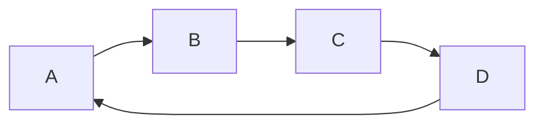

# Circular Queue

一般的隊列（Queue）:FIFO

|                |                    Queue                     |               Circular Queue               |
| :------------: | :------------------------------------------: | :----------------------------------------: |
|  資料排列方式  |                 線性順序排列                 |    循環順序排列，即將尾端和前端連接起來    |
| 插入和刪除操作 | 刪除操作都在前端進行 插入操作都在尾端進行 | 插入和刪除操作不固定 可以在任何位置進行 |
|   記憶體空間   |                     更多                     |                    較少                    |
|      效率      |                      低                      |                     高                     |

# DFS and BFS

**深度優先搜尋 (Depth-First Search, DFS)**

深度優先搜尋 (DFS) 是一種用於搜尋圖或樹結構中所有頂點的遞迴演算法。
它會沿著一條路徑一直深入到不能再走為止，然後回溯並探索其他路徑。

例如，假設我們有一個圖 G，其節點為 {0, 1, 2, 3}，邊為 {(0, 1), (0, 2), (1, 2), (2, 3)}。

如果從節點 2 開始步驟如下：

1. 訪問節點 2
   我們首先訪問節點 2，並將其標記為已訪問。
2. 選擇並訪問一個相鄰的未訪問節點
   從節點 2 的相鄰節點中選擇一個未訪問的節點（假設選擇節點 3），並訪問它。標記節點 3 為已訪問。
3. 繼續深入訪問節點 3 的相鄰未訪問節點
   檢查節點 3 的相鄰節點，發現節點 3 沒有未訪問的相鄰節點，則回溯到節點 2。
4. 回溯並選擇另一個相鄰的未訪問節點
   回到節點 2，選擇另一個相鄰的未訪問節點（節點 0），並訪問它。標記節點 0 為已訪問。
5. 深入訪問節點 0 的相鄰未訪問節點
   檢查節點 0 的相鄰節點，發現節點 1 是未訪問的，於是訪問節點 1，並標記它為已訪問。
6. 繼續深入或回溯
   檢查節點 1 的相鄰節點，發現節點 1 連接到的節點 2 已經被訪問，無其他未訪問節點，則回溯到節點 0，再回溯到節點 2。
7. 結束搜尋
   當回溯到節點 2 且所有相鄰節點都已訪問時，深度優先搜尋結束。

**廣度優先搜尋 (Breadth-First Search, BFS)**

在 BFS 中，從起點節點開始，逐層地擴展搜索，先探索所有與起點節點相鄰的節點，然後再逐層探索與這些節點相鄰的節點，以此類推。

BFS 使用一個稱為**佇列（Queue）**的資料結構來維護待處理的節點。

1. 將起點節點放入佇列中。
2. 從佇列中取出一個節點，將其標記為已訪問，並擴展搜索到該節點相鄰的未訪問節點，將這些節點加入佇列中。

**重複**這個過程，直到佇列中沒有未訪問的節點為止。

BFS 的特點是以**廣度**作為搜索的優先順序。也就是說，BFS 先搜索距離起點節點最近的節點，然後再搜索稍遠一些的節點。這意味著，當使用 BFS 搜索時，可以找到從起點到目標節點的最短路徑（如果存在）。

BFS 可以用在圖形算法、迷宮解決、最短路徑問題等。它確保在搜索過程中先處理較近的節點，因此通常用於找尋最短路徑或尋找圖形中的最短距離。

|                |                DFS                 |  BFS   |
| :------------: | :--------------------------------: | :----: |
| 使用的資料結構 |               Stack                | Queue  |
|      順序      | 不唯一(若vertex從小到大拜訪則唯一) | 不唯一 |

# 雜湊函數 (Hash Function)

**雜湊函數 (Hash Function)** 是一種數學函數，它將任意大小的輸入數據（稱為**資料**）轉換為固定大小的輸出字串（稱為**雜湊值**）。

例如我們將 `Hello World!` 的字串分別用MD5、SHA1、SHA256
MD5: `ed076287532e86365e841e92bfc50d8c`
SHA1: `2ef7bde608ce5404e97d5f042f95f89f1c232871`
SHA256: `7f83b1657ff1fc53b92dc18148a1d65dfc2d4b1fa3d677284addd200126d9069`

- 雜湊函數會希望是不可逆
- 雜湊函數可能會有相同的情況（碰撞）
- 原始資料有小變動，則希望雜湊值更大的變化（Avalanche Effect）
