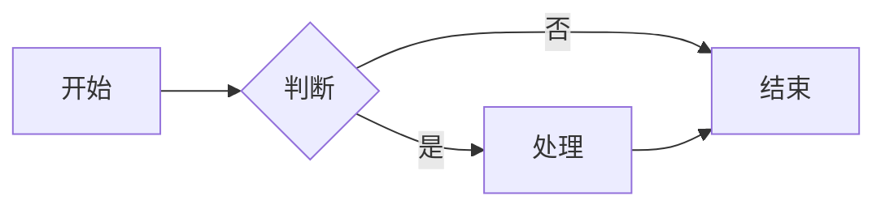
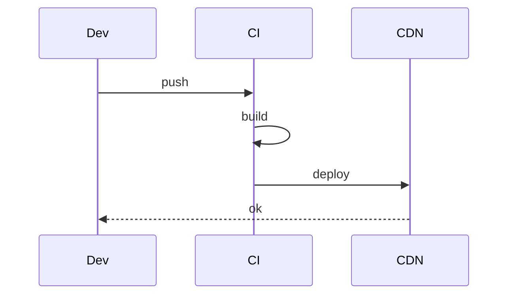

## 无标题图表

```mermaid
graph LR
    A[开始] --> B{判断}
    B -->|是| C[处理]
    B -->|否| D[结束]
    C --> D
```

## 带标题的图表

```mermaid title="部署流程"
sequenceDiagram
    participant Dev
    participant CI
    participant CDN
    Dev->>CI: push
    CI->>CI: build
    CI->>CDN: deploy
    CDN-->>Dev: ok
```
