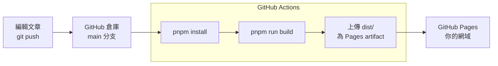
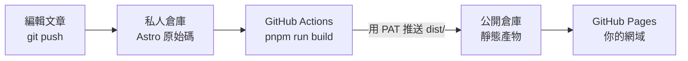

import HexoLinksTag from "@/components/post/HexoLinksTag.astro";

## Shoka 主題：起源、現況與衍生主題

Shoka 是一個 Hexo 主題，名字取自`書架`，是一個為了閱讀筆記而生的主題，相關介紹可以參考作者網站: https://shoka.lostyu.me/computer-science/note/theme-shoka-doc/。

<HexoLinksTag
  links={[
    {
      url: "https://shoka.lostyu.me",
      title: "優萌初華",
      desc: "Shoka作者",
      author: "霜月琉璃",
      avatar: "https://cdn.jsdelivr.net/gh/amehime/shoka@latest/images/avatar.jpg",
      color: "#e9546b",
    },
  ]}
/>

### Shoka 還能用嗎？

該項目可能不再更新，GitHub 上最後的 Commit 日期是 [2021/10/03](https://github.com/amehime/hexo-theme-shoka)。

:::info
目前的 Hexo Shoka 主題部落格可能因為套件版本問題導致無法訪問。
:::

### Shoka 首頁波浪動畫的來源：CodePen 的 Simple CSS Waves

Shoka 首頁的上下起伏、水波般的動畫效果，使用了 CodePen 上 Goodkatz 於 2019/08/13 發布的 [Simple CSS Waves | Mobile & Full width](https://codepen.io/goodkatz/pen/LYPGxQz)，是一個純 HTML + CSS + SVG 實作。

比對 Shoka 編譯後頁面的原始碼可以發現，`<svg class="waves">` 容器、`id="gentle-wave"` 的 path 座標、`.parallax` 圖層結構幾乎逐字元相同，僅省略了 CodePen 原版中的漸層背景色與 logo 部分。

- 一個 `id="gentle-wave"` 的 SVG path，座標為  `M-160 44c30 0 58-18 88-18s 58 18 88 18 58-18 88-18 58 18 88 18 v44h-352z`
- 用 4 個 `<use>` 疊出深淺不同的波浪層，包在 `.parallax` 容器內
- 搭配 `move-forever` 的 `@keyframes`，讓各波浪層以不同的 `animation-delay` 與  `duration` 緩緩位移，做出水波飄動的視覺效果

### Shoka 風格的衍生主題有哪些？astro-koharu、Yukina、Mizuki

1. https://github.com/cosZone/astro-koharu


2. https://github.com/WhitePaper233/yukina


3. https://github.com/LyraVoid/Mizuki


## ShokaX 版本差異

| | [Shoka](https://github.com/amehime/hexo-theme-shoka) | [shokaX (Hexo)](https://github.com/theme-shoka-x/hexo-theme-shokaX) | [Astro Blog ShokaX](https://github.com/theme-shoka-x/astro-blog-shokax) |
| --- | --- | --- | --- |
| 框架 | Hexo | Hexo | Astro |
| 技術棧 | JS + Nunjucks | TypeScript + Vue 3 + Pug | Astro + Svelte 5 + UnoCSS |
| 最後更新 | 2021/10/03 | Hexo 版於 2025/12/26 公布了 [shokaX (Hexo) 生命週期方案](https://github.com/theme-shoka-x/hexo-theme-shokaX/discussions/463)。<br />最後版本為 v0.5.4（2025/07/28）。 | 目前的主要開發版本 |

## ShokaX Astro：目前的主要開發版本

https://github.com/theme-shoka-x/astro-blog-shokax

ShokaX 是 Shoka 的精神續作。在 Astro 上的重寫版本，使用 Astro + Svelte 5 + UnoCSS 的技術搭配。

安裝文檔：https://docs.astro.kaitaku.xyz/start/guides/

```bash
git clone --depth=1 https://github.com/theme-shoka-x/astro-blog-shokax.git
cd ./astro-blog-shokax
pnpm install
pnpm run dev
```

## 部署前：pnpm run build 產出什麼

說明文件: https://docs.astro.kaitaku.xyz/start/deploy/

執行 `pnpm run build` 後產物在 `dist/` 資料夾，為純靜態網站，可部署到任何靜態託管平台。

:::warning
`pnpm run build` 是兩個步驟：`build:site`（`astro build`）加上 `build:index`（`pagefind`）。
站內搜尋的索引是 Pagefind 在 build 時掃描 `dist/` 產生的，
所以在 CI 上**一定要呼叫 `pnpm run build`**，只跑 `astro build` 會讓搜尋功能失效。
:::

## 部署到 Cloudflare Worker

目前的 Cloudflare Pages 也可以創立，但是 Cloudflare [計畫將 Workers 與 Pages 整合](https://developers.cloudflare.com/workers/static-assets/migration-guides/migrate-from-pages/)，以下是 Cloudflare Workers 的說明。

- [public/_redirects](https://developers.cloudflare.com/workers/static-assets/redirects/)允許自訂轉址，用於文章網址更換時繼承 SEO 排名。
- [public/_headers](https://developers.cloudflare.com/workers/static-assets/headers/)，自訂 HTTP Header 標頭。
- 非正式分支的每次 commit 都會有獨立的預覽版本網址

1. 在 Cloudflare Dashboard 建立 Worker 時選 Import a repository（匯入 Git 倉庫）
2. 授權 GitHub 並選擇倉庫
3. 填入[設定](https://developers.cloudflare.com/workers/ci-cd/builds/configuration/)：

| 設定項目                            | 值                | 說明                                                                              |
| ----------------------------------- | ----------------- | --------------------------------------------------------------------------------- |
| Project name                        | 自訂              | 同時是 Worker 名稱，預設網址會是 `<專案名>.<你的子網域>.workers.dev`              |
| Build command                       | `pnpm run build`   | 不需要自己加 `pnpm install`，Cloudflare 會先裝好依賴，見下方                        |
| Deploy command                      | `npx wrangler deploy` | 預設值，前提是倉庫裡有 wrangler 設定檔；沒有的話見下方                        |
| Builds for non-production branches  | 依需求            | 勾選後非正式分支的 commit 會跑 `npx wrangler versions upload`，產生預覽版本而不影響正式部署 |


4. 建完後到 Settings 把 Git branch 改成要部署的分支

5. 推一個 commit 到該 branch 觸發部署

### [wrangler 設定檔](https://developers.cloudflare.com/workers/wrangler/configuration/)

```jsonc
{
  "name": "你的-worker-名稱",
  "compatibility_date": "2026-07-30",
  "assets": {
    "directory": "./dist",
    "not_found_handling": "404-page"
  }
}
```

:::info
`name` 要與 dashboard 上的專案名稱一致，不然建置會失敗，且 [Cloudflare 會直接對你的倉庫開一個 PR 來改這個欄位](https://developers.cloudflare.com/changelog/2025-02-20-builds-name-conflict/)
:::

不想放一份 `wrangler.jsonc` 在倉庫根目錄的話，可以把這些改用旗標帶在 Deploy command 上：

```
npx wrangler deploy --assets ./dist --name 你的-worker-名稱 --compatibility-date 2026-07-30
```

## 部署到 GitHub Pages：公開倉庫與私人倉庫兩種做法

GitHub Actions 是 GitHub 提供的一項 CI/CD（持續整合與持續部署）服務，讓使用者能夠自動化軟體開發工作流。它允許你在特定事件發生時執行定義好的動作，例如程式碼推送、Pull Request 建立、Release 發布等，並使用 YAML 檔案來定義你的工作流。工作流檔案放在倉庫的 `.github/workflows` 目錄中。

開始之前先決定一件事：**要不要把倉庫隱藏起來？**
因為 [GitHub Pages 在免費方案下只支援公開倉庫](https://docs.github.com/en/get-started/learning-about-github/githubs-plans)，私人倉庫要發布 Pages 需要 GitHub Pro / Team / Enterprise 方案。

| 　                | 方案一: 原始碼 repositories 權限公開            | 方案二: 原始碼 repositories 權限私人                                            |
| ----------------- | --------------------------- | ------------------------------------------------------------- |
| 倉庫可見性        | Public                      | Private                                                       |
| 方案需求          | 免費方案就能用              | 免費方案需要再開一個公開倉庫；GitHub Pro 以上可直接用方案一的做法 |
| 倉庫數量          | 1 個                        | 2 個（私倉放原始碼、公倉放產物）                              |
| 需要 PAT          | 不需要                      | 需要                                                          |
| 發布方式          | `actions/deploy-pages`      | 把 `dist/` 推送到公開倉庫                                     |

### 方案一: 原始碼 repositories 權限公開

1. 編輯部落格內容後，使用 Git 將變更推送到 GitHub 倉庫
2. 倉庫的 Workflow 會把原始碼 build 成靜態網頁
3. 將 `dist/` 目錄下的產物（編譯後的靜態網頁）上傳為 Pages artifact
4. 由 `actions/deploy-pages` 把 artifact 發布到 GitHub Pages



#### Workflow 的完整範例

`.github/workflows/deploy.yml`

```yml
name: Deploy Astro ShokaX to GitHub Pages

# 當有新的提交推送到 main 分支時觸發；
# 另外加上 workflow_dispatch，讓你可以在 Actions 頁面手動觸發
# （例如沒有新的提交，但想重新發布一次）
on:
  push:
    branches:
      - main
  workflow_dispatch:

# 從 Actions 直接發布 Pages 需要這三個權限：
# pages: write   用來發布
# id-token: write 用來讓 deploy-pages 取得 OIDC 身分驗證
# contents: read  用來 checkout 原始碼
permissions:
  contents: read
  pages: write
  id-token: write

# 同一時間只允許一個部署。這裡刻意用 false：新的推送只會跳過還在排隊的舊 run，
# 但不會中斷正在發布中的部署（中途取消 deploy-pages 有可能讓 Pages 環境卡住）
concurrency:
  group: "pages"
  cancel-in-progress: false

jobs:
  # 拆成 build 與 deploy 兩個作業，deploy 用 needs: build 等待建置完成。
  # 兩個作業都在最新版本的 Ubuntu 環境中執行。
  build:
    runs-on: ubuntu-latest
    # 為 build 設置 20 分鐘的超時限制
    timeout-minutes: 20
    steps:
      # 1. 使用 actions/checkout 把倉庫中的所有檔案和目錄複製到 GitHub Actions 執行器的工作目錄中
      - name: Checkout Repository
        uses: actions/checkout@v7

      # 2. 設置 pnpm 與 Node.js
      - name: Set up pnpm
        uses: pnpm/action-setup@v4
        with:
          version: 11.22.0

      - name: Set up Node.js
        uses: actions/setup-node@v4
        with:
          node-version: "22"
          cache: pnpm

      # 3. build 之前，configure-pages 會把 Pages 的設定注入建置環境
      - name: Configure Pages
        uses: actions/configure-pages@v6

      # 4. 依照 pnpm-lock.yaml 安裝依賴。
      - name: Install dependencies
        run: pnpm install --frozen-lockfile

      # 5. 建置站點並產生 Pagefind 搜尋索引
      - name: Build
        run: pnpm run build

      # 6. 上傳 dist/ 目錄下的產物（編譯後的靜態網頁）作為 Pages artifact
      - name: Upload artifact
        uses: actions/upload-pages-artifact@v5
        with:
          path: ./dist

  deploy:
    needs: build
    runs-on: ubuntu-latest
    environment:
      name: github-pages
      url: ${{ steps.deployment.outputs.page_url }}
    steps:
      # 7. deploy-pages 會把上一步的 artifact 部署到 Pages
      - name: Deploy to GitHub Pages
        id: deployment
        uses: actions/deploy-pages@v5
```

### 方案二: 原始碼 repositories 權限私人

不想讓別人看到原始碼（草稿、加密文章的密碼、私人筆記）。如果你有 GitHub Pro 以上方案，私人倉庫可以直接發布 Pages，用上方的 workflow 做就好，倉庫設成 Private 即可。

免費方案的私人倉庫沒辦法直接開 GitHub Pages，得繞一圈。
1. 讓私人倉庫負責 build
2. 再把 `dist/` 推送到另一個**公開**倉庫
3. 由公開倉庫來當 GitHub Pages

公開倉庫裡只有編譯後的靜態檔案，原始碼仍然是私有的。這樣做需要自己產生一組 Token，讓 workflow 有權限寫入另一個倉庫。



#### 在 GitHub Setting 產生一個 Key

1. 點擊 Developer Settings


2. 點擊 Generate new token


3. 權限添加 workflow


4. 回到專案的 repo Setting


5. Name 填入自定義名稱，Secret 填入第 `3` 步產生的 token


#### workflow

拿方案一的 workflow 來改，完整版如下：
```yml
name: Deploy Astro ShokaX to Public Repo

on:
  push:
    branches:
      - main
  workflow_dispatch:

concurrency:
  group: "pages"
  cancel-in-progress: false

jobs:
  build:
    runs-on: ubuntu-latest
    timeout-minutes: 20
    steps:
      - name: Checkout Repository
        uses: actions/checkout@v7

      - name: Set up pnpm
        uses: pnpm/action-setup@v4
        with:
          version: 11.22.0

      - name: Set up Node.js
        uses: actions/setup-node@v4
        with:
          node-version: "22"
          cache: pnpm

      - name: Install dependencies
        run: pnpm install --frozen-lockfile

      - name: Build
        run: pnpm run build

      # 用剛才存進 Secrets 的 `API_TOKEN_GITHUB` 進行身份驗證
      # 把 `dist/` 推送到公開倉庫（例如 `minz71/minz71.github.io`）的 `main` 分支
      - name: Pushes to another repository
        uses: cpina/github-action-push-to-another-repository@main
        env:
          API_TOKEN_GITHUB: ${{ secrets.API_TOKEN_GITHUB }}
        with:
          source-directory: "./dist"
          destination-github-username: "minz71"
          destination-repository-name: "minz71.github.io"
          user-email: XXX@gmail.com
          target-branch: main
```
### 設定 GitHub Pages

1. 到 Repository > Settings > Pages
2. Source 選擇
  私人倉庫做法: Source 選擇 `GitHub Actions`
  公開倉庫做法: Source 選擇 `Deploy from a branch`，分支選 `main`、目錄選 `/ (root)`
3. 設定 Custom domain（在 DNS 添加 CNAME 紀錄）

:::info
GitHub Pages 不支援 `public/_redirects`，舊網址的 301 轉址在 GitHub Pages 上不會生效，需要轉址就得改用 Cloudflare Pages 或 Cloudflare Workers，或自己產生轉址用的 HTML。
:::